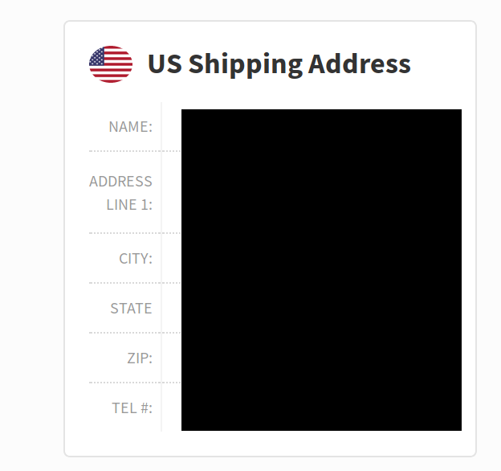

If you're anything like me, you're probably always looking for a good deal. Buying second-hand, never buying anything at full price, doing research beforehand just to make sure you're getting the best deal and would walk a few more meters just because the grocery store over there has the same ice cream for 3 pesos cheaper. 

When buying something as valuable as a laptop, doing the above could mean spending 10,000 pesos less than what you would have spent just going to your local mall and buying the first thing that catches your eye and budget.

In this post you'll see I've written several paragraphs explaining why I chose what I bought (a secondhand laptop I bought from eBay and shipped using [LBC's ShippingCart](https:www.shippingcart.com). 

### Here's why you should try this method.

1. You get the latest models, the better models (equipped with more RAM or an SSD instead of an HDD) and the better variety buying from [eBay](https://www.ebay.com) and [Amazon](https://www.amazon.com)

2. If buying secondhand or refurbished is your preferred option, nothing beats buying from [eBay](https://www.ebay.com) because, for one; you get more options by the sheer amount of sellers and users on ebay, and two they've got the [eBay money back guarantee](https://pages.ebay.com/ebay-money-back-guarantee/) which assures you that if you get scammed, or you didn't get the product described, there's a big chance you'll get your money back. Amazon also sells secondhand stuff but I much prefer prices on eBay.

3. It gets delivered **straight** to your doorstep. No need to be hassled by customs or going to the post-office to pick up your package.

4. It's way cheaper to buy on eBay and Amazon for the same, most of the time strictly better, product.

### Points to consider against this method

1. Ordering the product to receiving the product usually takes around 2 weeks (1 week to get the product to your ShippingCart warehouse, another week to ship from the warehouse to your address). If you need the product ASAP, then by all means buy locally. 

2. Warranties are a gray area. It would depend entirely on your seller to set the terms for your returns and even after settling that, you'll probably have to pay for shipping it back and then you're going to have to wait some more to get you replacement.

3. Unlike Shopee or Lazada, as of writing this, on eBay you're going to need a credit card, a debit card or PayPal to pay for your purchases, ShippingCart only takes credit cards and PayPal, and  Amazon only takes debit cards and credit cards.

_Now with that out of the way, how do we actually use this magical method to get cheaper deals on laptops?_

### Making a ShippingCart account

_You don't actually have to use ShippingCart there are other services available I have no personal experience with (Like [JohnnyAirPlus](https://johnnyairplus.com/), [Jinio](https://jinio.com.ph/), [My-ShoppingBox](https://my-shoppingbox.com/)). It's just that I've only ever used ShippingCart and they have yet to mess up a delivery_

1. [Create your account](https://www.shippingcart.com/signup), pretty straightforward.
2. Once on your account's page, look for  this address box at the upper left of the page  
   This is where your warehouse is located and where all of your ordered products should be shipped to and instead of a black box you should see your US address and a phone number
3. Once you've got your address, it's time to order your laptop

### Deciding on what to buy, and what to look for

1. Well first you have to decide what you're going to use the laptop for, and if you actually need a laptop (building a PC can be cheaper if you don't really need the mobility)
2. For any laptop you buy, I urge you to buy one with an SSD. The difference between using HDDs and SSDs is night and day, I cannot stress enough how big the difference is.
3. Things you need to look out for
    * Gaming: Get a laptop with a good GPU and decent processor. I highly recommend atleast a GTX 1050 to play most newer titles at low-medium settings while getting decent frames. As of writing this, Nvidia was about to release RTX 20XX graphics cards so watch out for those.
    * Content Creation: For most light content creation you'd probably do fine with more recent devices, but for special content like video or 3D rendering make sure to get a fast (at least) quad core processor and a decent graphics card (Both of which are reserved for the higher end of laptops. Sometimes a good gaming laptop can also be a good content creation one)
    * Light use/Office work/Programming: Most devices released within the past 3 - 2 years will get by running multiple browser tabs and multiple instances of Microsoft Office and Microsoft Excel running as long as you have at least 8 GB of RAM. If you really want a snappy experience, get one with an SSD. The best choice for this type of work are ultrabooks. Ultrabooks are just extremely light laptops focused on sacrificing processing and graphics for portability and battery life (at least 8 hours of regular use). 

_Disclaimer: Use of information at own risk. I assume no responsibility in you getting scammed or getting a defective product. It is **YOUR** responsibility to evaluate whether the product or products you are buying are legitimate and functional. There is always a chance of buying a defective product or getting scammed no matter what you buy. The blog aims to outline my personal experiences and my personal takeaways from my experiences_