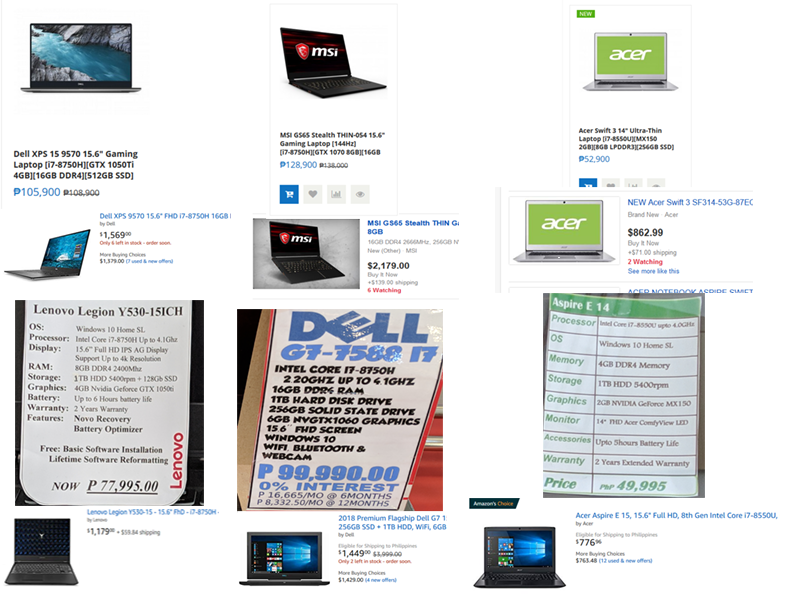
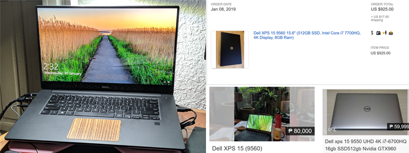

When looking for a laptop, you've probably never considered using Amazon, Ebay or any other US based sellers. But that's a big mistake, not only are the options cheaper, they're also better. What this post aims to show is you can save thousands of pesos by buying abroad and hopefully how to take advantage of this by using services like [ShippingCart](https:www.shippingcart.com).

### Comparing prices

_The prices in dollars are from Amazon and Ebay, and the prices in pesos are from Philippine stores._ 

What the picture above shows is that not only are the prices in US stores cheaper by $200 - $600, the products also have better specs out of the box (_see the Philippine Acer Aspire with only 4GB of RAM and HDD where as the same laptop on Amazon comes with an SSD, 8GB RAM and is cheaper_)

I've watched reviews, researched prices, searched online stores, visited electronic stores and looked through olx.ph for for a few months now. It's all the same, you're better of buying one from America if you value your money.

_"Alright I'm convinced, but how am I supposed to have them shipped to me and how much is shipping going to cost?"_ I'm glad you asked because...

### Ordering is easy

1. Make an account for services like [ShippingCart](https:www.shippingcart.com), [JohnnyAirPlus](https://johnnyairplus.com/), [Jinio](https://jinio.com.ph/), [My-ShoppingBox](https://my-shoppingbox.com/). 

_I've personally only ever used ShippingCart so most of this will be based on my experience with their service but the others should be pretty similar_
2. Order the product from your selected store and have it shipped to the US address provided
3. Wait for the package to arrive to your US address
4. Have it shipped to your **Philippine address**. 
5. Wait for it to arrive to the Philippines. This will vary from service to service but ShippingCart delivers straight to your doorstep.

ShippingCart calculates price by weighing the package or calculating the volume, and they take whichever costs more (I don't know how the others calculate price). Based on personal experience the cost of shipping has never exceeded $150, and most of the time will only cost anywhere between $20 - $80.

The amount of money you save is huge even after factoring in shipping. 

### My most recent experience

I bought a fully specced Dell XPS 15 9560 with a 4K screen for $950 (I paid around PHP56,000 for the laptop and shipping). 

When I compared it to the prices of the same used laptop model with **WORSE** specs (not 4k screen, less RAM and storage) the prices all hovered between PHP70,000 - PHP80,000. 

I essentially saved PHP15,000 and all I had to do was wait a week more to get my laptop, and I'm so happy I did.

_Left is an actual picture of the laptop, upper right is the actual amount I paid for the laptop (shipping was around $150), lower right are two same model laptops but with worse specs costing PHP24,000 more and PHP4,000 more than what I spent, the other one is of the previous generation_

### Possible downsides

Unfortunately there are downsides to this, so if any of the following make you feel uncomfortable, you may want to try something else

* Returning a product for warranty or defects may cost you more money in the case that you are unhappy with your product. This has never happened to me with all of my 12 orders, 3 of which were used laptops.

* You are going to have to wait around 2 weeks before you get your product, so if you need it ASAP try somewhere else.

**Disclaimer: If you are going to try this, please do it at your own risk! It is YOUR responsibility to evaluate whether the product or products you are buying are as advertised**