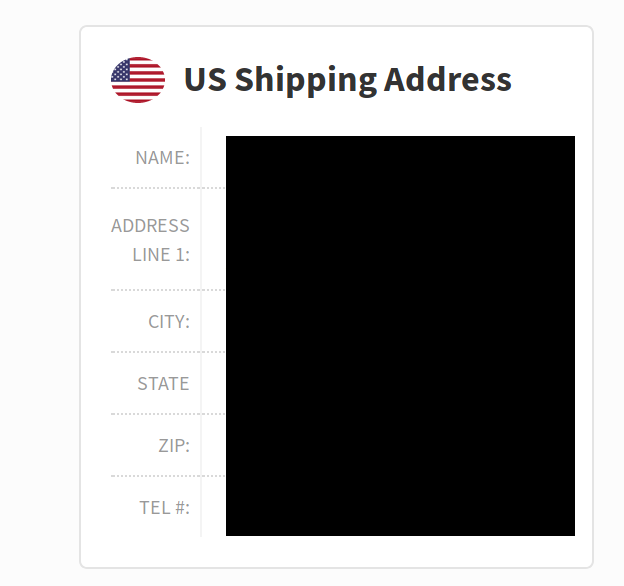
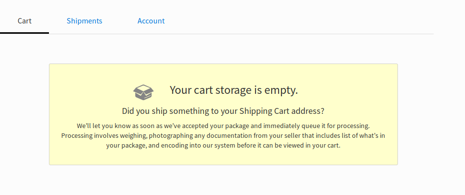
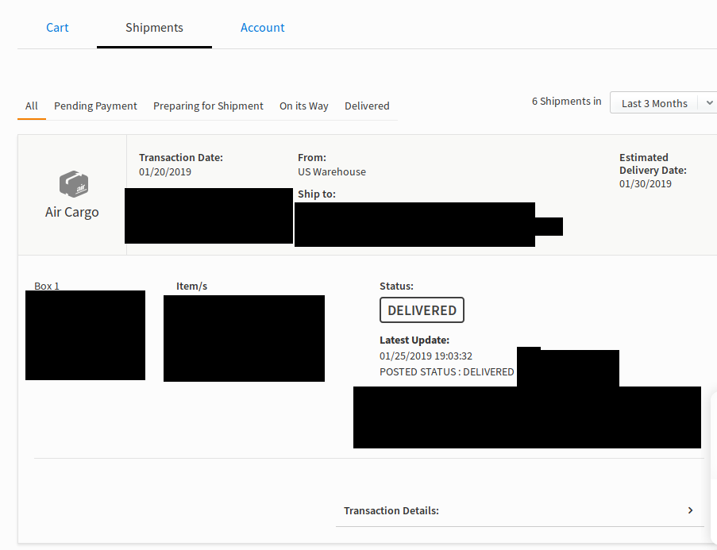

If you're coming from my [laptop buying post](/laptop-buying) or just curious 

If you're anything like me, you're probably always looking for a good deal. Buying second-hand, never buying anything at full price, doing research beforehand just to make sure you're getting the best deal and would walk a few more meters just because the grocery store over there has the same ice cream for 3 pesos cheaper. 

When buying something as valuable as a laptop, doing the above could mean spending 10,000 pesos less than what you would have spent just going to your local mall and buying the first thing that catches your eye and budget.

In this post you'll see I've written several paragraphs explaining why I chose what I bought (a secondhand laptop I bought from eBay and shipped using [LBC's ShippingCart](https:www.shippingcart.com). 

### Here's why you should try this method.

1. You get the latest models, the better models (equipped with more RAM or an SSD instead of an HDD) and the better variety buying from [eBay](https://www.ebay.com) and [Amazon](https://www.amazon.com)

2. If buying secondhand or refurbished is your preferred option, nothing beats buying from [eBay](https://www.ebay.com) because, for one; you get more options by the sheer amount of sellers and users on ebay, and two they've got the [eBay money back guarantee](https://pages.ebay.com/ebay-money-back-guarantee/) which assures you that if you don't receive the product or if the product isn't as described, there's a big chance you'll get your money back at the cost of sending back the product though. Amazon also sells secondhand stuff but I much prefer prices on eBay.

3. It gets delivered **straight** to your doorstep. No need to be hassled by customs or going to the post-office to pick up your package.

4. It's way cheaper to buy on eBay and Amazon for the same, most of the time strictly better, product.

### Points to consider against this method

1. Ordering the product to receiving the product usually takes around 2 weeks (1 week to get the product to your ShippingCart warehouse, another week to ship from the warehouse to your address). If you need the product ASAP, then by all means buy locally. 

2. Warranties are a gray area. It would depend entirely on your seller to set the terms for your returns and even after settling that, you'll probably have to pay for shipping it back and then you're going to have to wait some more to get you replacement.

3. Unlike Shopee or Lazada, as of writing this, on eBay you're going to need a credit card, a debit card or PayPal to pay for your purchases, ShippingCart only takes credit cards and PayPal, and  Amazon only takes debit cards and credit cards.

_Now with that out of the way, how do we actually use this magical method to get cheaper deals on laptops?_

### Making a ShippingCart account

_You don't actually have to use ShippingCart there are other services available I have no personal experience with (Like [JohnnyAirPlus](https://johnnyairplus.com/), [Jinio](https://jinio.com.ph/), [My-ShoppingBox](https://my-shoppingbox.com/)). It's just that I've only ever used ShippingCart and they have yet to mess up a delivery_

1. [Create your account](https://www.shippingcart.com/signup), pretty straightforward.
2. Once on your account's page, look for  this address box at the upper left of the page  
   _This is where your warehouse is located and where all of your ordered products should be shipped to and instead of a black box you should see your US address and a phone number_
3. Once you've got your address, it's time to order your laptop

### Ordering your new laptop

For whatever laptop you end up choosing, you can't go wrong with either Amazon or eBay. EBay has the better second hand choices if you're okay with buying used, just make sure to check out the seller first, eBay shows the seller's score, percentage of positive reviews, and actual reviews from previous transactions. Amazon has the better prices for brand new though and better shipping times if you have Amazon Prime.

So put in an order for your laptop, pay for it and then have it delivered to your ShippingCart warehouse (don't worry if the shipping indicates "requires signature" this just means that someone has to be at the location to pickup the package, and the warehouse will always have people to receive the package) and wait for it to arrive. Depending on where you bought it this could take anywhere from 2 - 7 days.

Once your package arrives at the warehouse you'll receive an email saying that they have accepted your package and that it'll be processed before it appears in your shipping cart. This is where your package will be opened up, weighed, and reviewed.

### Package is ready for shipping

Once they're done processing your package, they'll send you an email and it should appear in your cart page.

 _This is what is would look like if your cart is empty_

Once there you're going to have to input the package value (for insurance purposes and items below $500 have free insurance and items over $500 will increase your shipping fee depending on how much the product is worth) The page should load for a bit, after that you can click the checkbox to calculate how much shipping will cost, unfortunately once it's in the warehouse there's nothing you can do to affect the shipping price. 

From all the things I've bought, only one product costed over $100 to ship. A laptop that was, unfortunately by fault of the US courier, shipped with a box almost three times it's size and filled with filler paper to help cushion the laptop, though I appreciate the care they took in handling the laptop, it greatly bloated the actual shipping fee. Most other shipments (even two other laptops) costed about $20 - $80. Shipping multiple items together can save you some money compared to shipping the products one at a time and storing your products in the warehouse is free up to 30 days, a storage fee will be added 31 days - 90 days, and they'll dispose of your item after 90 days. 

### Shipping your product

Once you've finalized the items you want to ship, you can ship the products by clicking the ship button. You'll then be asked to fill in your address, and payment information. Fill in your payment information (PayPal or Credit Card) and then enter your **Philippine address**, once you've made sure it's all correct you can input add a promo code if for some reason you have one and click the final pay button.

Your payment will be processed and you should be redirected to a thank you page. Once your payment has been accepted they will send you an email and by then you can check track your package by heading over to the shipments tab

 _Here you'll see your package information. This is also the page where you can track shipments_

When you see your package on the shipments page with a status of "On it's way" all that's left to do is to wait. Shipments usually arrive in 5 - 7 days and I've never had any problems for the 12 packages I've had delivered (fortunately) so I don't exactly have prior experience with their customer support. I've tried asking a question though through their little automated chat bubble thing and it's a bit useless. You should probably contact their customer support at [customercare@shippingcart.com](customercare@shippingcart.com) if you want human interaction.

_Disclaimer: Use of information at own risk. I assume no responsibility in you getting scammed or getting a defective product. It is **YOUR** responsibility to evaluate whether the product or products you are buying are functional and as advertised. There is always a chance of buying a defective product or wanting to return your order no matter what you buy. The blog aims to outline my personal experiences and my personal takeaways from my experiences_