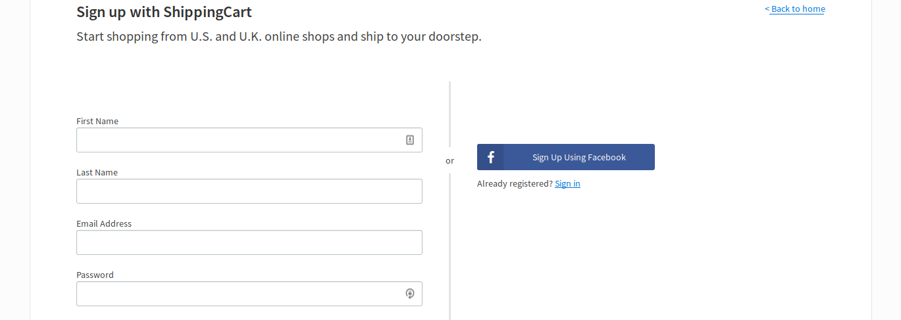
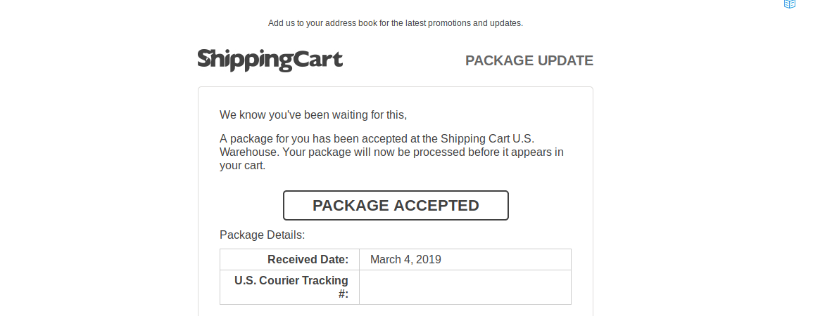
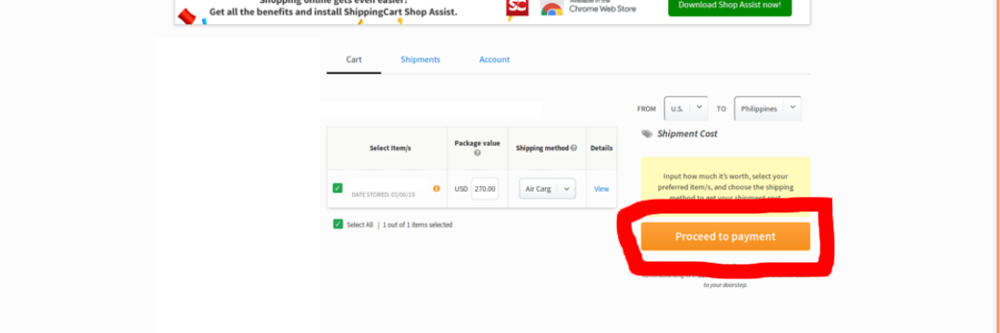
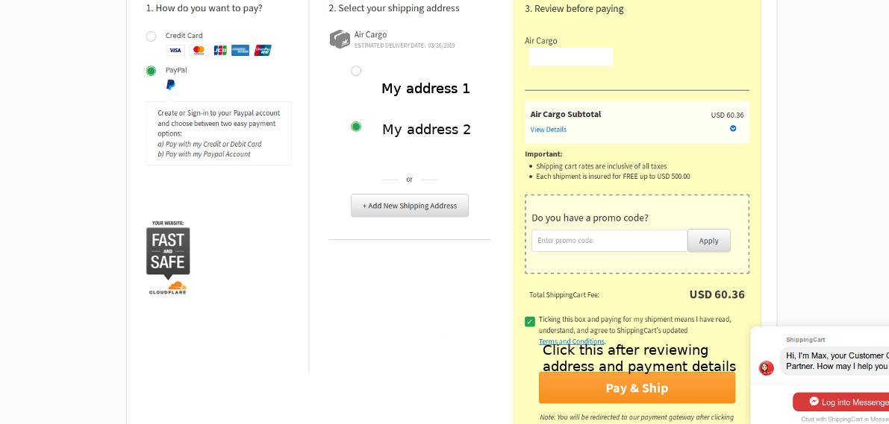
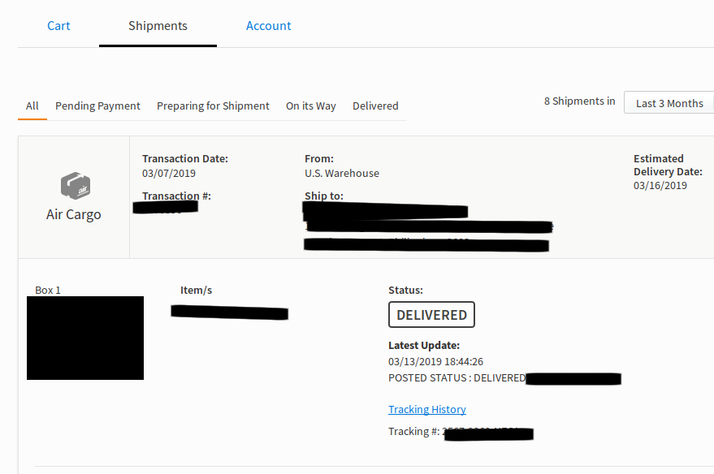

If you've ever wanted to buy things from abroad but are intimidated by high shipping fees, customs tampering your packages, customs holding your package indefinitely or hate dealing with customs in general, ShippingCart might be just for you.

### What is ShippingCart

You can think of ShippingCart as your own private US Address. You buy products and have them delivered to ShippingCart's address (referred to as the warehouse from now on) and then have you package delivered straight to you, no need to deal with customs or other fees besides shipping.

### My experience

I've been using ShippingCart for over a year now and I've had them deliver over a dozen items by now on multiple occasions, with products worth $10 to up to $1000.

### How do you order from the US?

1. Create your account with ShippingCart
2. Purchase your item and have it shipped to the warehouse
3. Wait for the package to arrive at the the warehouse
4. Review the items and declare their value.
5. Choose your preferred payment method, and choose or enter your PHILIPPINE address.
6. (OPTIONAL) Document opening of your sealed package for proof in case of returns or defects.

### 1. Create your account with ShippingCart

So headover to [ShippingCart's home page](https:www.shippingcart.com) and click Sign Up or head to their [Sign Up page](https://www.shippingcart.com/signup) Fill in your info and then login.

At the landing page when you login, you should see this part at the left side of the screen containing a US Address and a UK Address below it. Take note of this, because this is what you enter as your shipping information when buying from the store.

### 2. Purchase your item and have it shipped to your ShippingCart address

Notable stores include Amazon and eBay. I buy almost everything that can be had for cheaper on eBay, [things like laptops](/laptop-buying), cellphones, and most electronics and also clothing brands I would not normally find here in the Philippines. 

This is pretty straightforward. Most websites have you fill up your address before or while checking out, some have you enter your address to be stored with your account. Make sure you enter the address given to you by ShippingCart. 

##### _Just a tip a credit card is the best payment method I can suggest you have before attempting this. Most stores accept PayPal or debit cards but there are some stores that only accept credit cards. Just make sure you're diligent with paying off your debts on time_

### 3. Wait for the package to arrive at the the warehouse

This will take time, it will usually take 2 - 7 days before your item arrives at the warehouse. Most stores will provide a tracking number so find out what shipping company the store used, get your tracking number and track your package there.

When your item finally arrives you're going to receive an email saying that your product has been accepted to the warehouse

### 4. Review the items and declare their value.

After a day or two you will receive another email stating that your product has been accepted and is ready to be shipped. When you receive that, you can login to your ShippingCart account and click the Shipments tab

You should see your shipment and some pictures of your item. You can enter the cost of the item here and after entering the declared cost of the item, the cost of shipping should appear on the right side above the "Proceed to payment" button.

##### _Tip: If you're planning to buy multiple items worth less than $500, it's best to have them all shipped at the same time, you save about $10 per item if you ship them together compared to shipping them separately. This doesn't apply to items worth over $500, in my experience items over $500 inflate the price you're going to pay so it's best you have those high value items shipped alone._

### 5. Choose your preferred payment method, and choose or enter your PHILIPPINE address.

Once the cost is calculated and you're sure you have all the items you want to be shipped, click proceed to payment

You should then be redirected to the payment page which looks like this. Choose your desired payment method (Debit card has never worked correctly for me, I've always used CC or PayPal) add your Philippine address if you haven't done so before and then click "Pay & Ship".

After that you will receive an email stating that your payment is being processed. If it fails, your products will be placed back to the Shipments page as pending shipment and you'll have to go through the process of paying again. If the payment is successful they will send you an email stating that your shipment is preparing for shipment and then eventually after a few hours to 2 days ShippingCart will send another email informing you that the shipment is on it's way with an estimated date of arrival. In my experience most shipments take 5 - 7 days to arrive.

From there you can track your shipment on your "Shipments" page.

### 6. (OPTIONAL) This goes for most shipments you receive not only from ShippingCart. Document yourself OPENING the sealed package, in the case that your package is damaged or is missing a product, you have video evidence to you can use to prove your claim.

After 5 to 10 days of waiting, there should be LBC delivery knocking at your door to deliver your package. 

I am lucky that after a dozen shipments I have never had a lost or damaged item but it's good to always be safe. So what I do is set up a video camera infront of me opening the SEALED package/s. In case an item is visibly damaged or an item is missing I can report it to LBC or ShippingCart with my proof.

### Final thoughts

So far, I'm pretty satisfied with this service. The most I've had to spend for a single package was $150 for a $1000 laptop, besides that no shipping has ever costed more than $80. The longest I've had to wait was 10 days which is far better than using DHL, EMS or Via Post which sometimes takes a month.

_Disclaimer: Use of information at own risk. I assume no responsibility in you getting scammed or getting a defective product. It is **YOUR** responsibility to evaluate whether the product or products you are buying are functional and as advertised. There is always a chance of buying a defective product or wanting to return your order no matter what you buy. The blog aims to outline my personal experiences and my personal takeaways from my experiences_