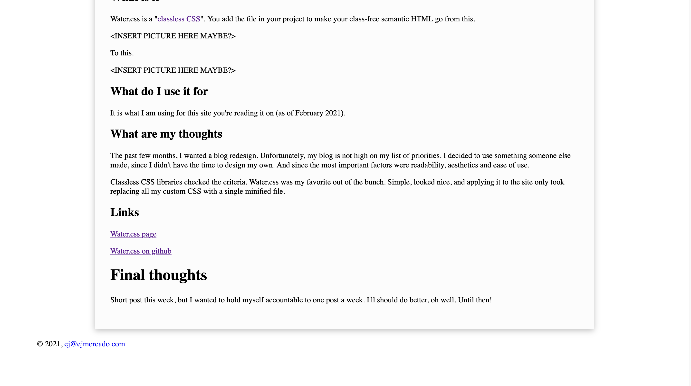
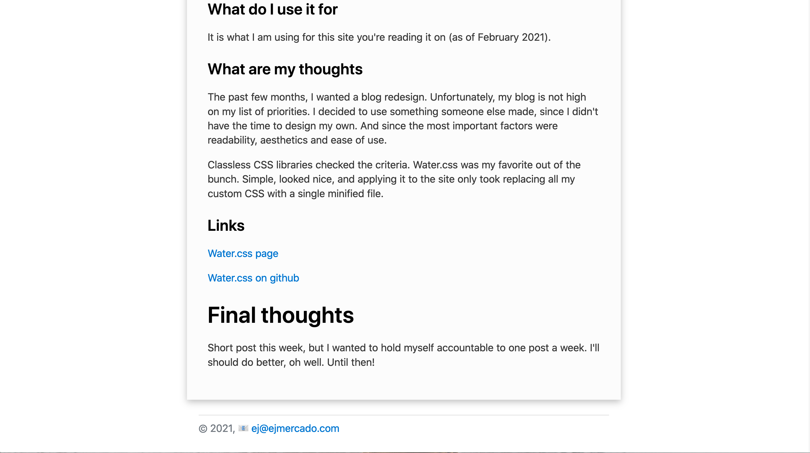

This is the second post of the series, WWW! Where I talk about new tech, I've used in the past week. This week we've got a Firebase competitor and a good-looking "classless CSS library".

# Supabase

## What is it

It's touted as an open source "Firebase". It's caught my attention with its choice of using Postgres over NoSQL. Its key feature is a cloud database accessible through UI dashboard or API. It's also got built-in user management where you can set policies to restrict access for different users.

## What do I use it for

For storing data, hence the term database. 

Right now, I'm giving it a test run on a web app I've been developing. This app scrapes data from multiple sources, processes it, and stores it in Supabase. The web app also has a client-side where I pull that data through Supabase's API.

I also plan on integrating its built-in user management into the app in the future.

## What are my thoughts

I'm a fan of the "back ends as a service" movement. For a few reasons.

1. **It makes bootstrapping projects so much easier.**
   
    I have bootstrapped a fair number of small apps with a custom database before. And to set things up I spent time reading documentations and tutorials. Time better spent on coding.

2. **Security is secure by default.**
    
    I admit to having exposed unsafe databases before. I was naïve then, especially with security where doing things the "easy way" is almost always the same as doing things the "wrong way"

    With Supabase, by default it gives you two types of API access keys. One type with "read-only access", and another more privileged type that has more privileges. Your database should be safe enough by only exposing a the public read-only key to let your app read data and keeping the privileged key secure with a server-side app doing the writing. And if your app needs user management, Supabase provides user roles that can be given to users. The roles allow the users elevated privileges with varying levels of restrictions.

## Links

[Supabase page](https://supabase.io/)

[Supabase on github](https://github.com/supabase)

# Water.css

## What is it

Water.css is a [classless CSS](https://github.com/dbohdan/classless-css). You add a file in your project to make your class-free semantic HTML go from this. 

To this.

## What do I use it for

It is what I am using for this site you're reading it on (as of February 2021). 

## What are my thoughts

The past few months, I wanted a blog redesign. Unfortunately, my blog is not high on my list of priorities. I decided to use something someone else made, since I didn't have the time to design my own. 

Classless CSS libraries checked the important criteria in my search: readability, aesthetics and ease of use. Water.css was my favorite out of the bunch. Simple, looked nice, and applying it to the site took only replacing all my custom CSS with a single minified file.

## Links

[Water.css page](https://watercss.kognise.dev/)

[Water.css on github](https://github.com/kognise/water.css)

# Final thoughts

Short post this week, but I wanted to hold myself accountable to one post a week. I'll should do better, oh well. Until then! 